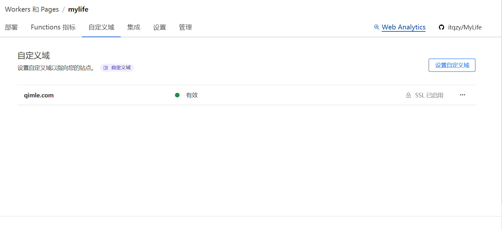

记录我站点从构建到部署的完整过程，使用了 Docusaurus 作为静态网站生成工具，托管于 GitHub 并通过 Cloudflare 实现无缝部署。整个过程成本几乎为零，非常适合个人和小型项目的博客、文档站点构建。


<!-- truncate -->

### 技术栈简介

站点使用的主要工具：

- **Docusaurus**: 一个现代化静态网站生成器，专注于生成文档与博客。
- **GitHub**: 用于代码托管与版本管理。
- **Cloudflare**: 提供免费 CDN 和部署服务，减少了服务器运维的麻烦和开销。
- **域名**: 仅需支付域名费用，甚至可以使用 Cloudflare 免费的域名服务。

### Docusaurus 简介

Docusaurus 是由 Facebook 开发的开源静态网站生成器。其主要特点是便于撰写和维护文档、博客，并支持 SEO 优化和多语言。借助 React 和 Markdown，用户能够快速定制站点的外观和内容，同时保持现代简洁的设计。

Docusaurus 不仅适合技术文档，也非常适合博客类网站。尤其对于不熟悉前端框架的人来说，它提供了即开即用的功能，让站长专注于内容创作，而非繁杂的界面开发。

#### Docusaurus 的主要功能

- **基于 React 构建**：现代化网站的核心架构，提供丰富的插件系统和自定义选项。
- **Markdown 支持**：内容书写简单直观，且支持扩展语法。
- **自动生成目录**：让长篇文章更具可读性。
- **SEO 优化**：自带 SEO 功能，提升搜索引擎可见度。
- **多语言支持**：内置翻译机制，适合全球化的站点。

#### 安装步骤

1. 确保已安装 Node.js（版本 ≥ 18.0），通过以下命令检查：

   ```bash
   node -v
   ```

2. 运行以下命令快速创建一个 Docusaurus 站点：

   ```bash
   npx create-docusaurus@latest my-website classic
   ```

3. 进入项目目录并启动本地服务器：

   ```bash
   cd my-website
   npx docusaurus start
   ```

本地服务器启动后，你可以在浏览器中访问 `http://localhost:3000` 预览站点效果。

### GitHub 和 Cloudflare 部署

#### GitHub 仓库配置

首先，将生成的 Docusaurus 项目上传到 GitHub。你可以使用以下步骤：

1. 在 GitHub 上创建一个新的仓库。

2. 在本地项目目录中，运行以下命令将代码推送到 GitHub：

   ```bash
   git init
   git add .
   git commit -m "Initial commit"
   git remote add origin <your-github-repo-url>
   git push -u origin master
   ```

#### Cloudflare Pages 部署

Cloudflare 提供了一种简单的方式来部署静态网站。以下是具体步骤：

1. 登录 [Cloudflare](https://dash.cloudflare.com/)，选择 **Workers** 或 **Pages**。
2. 创建一个新项目，选择 **Pages**，然后点击 **Link to Git** 连接到 GitHub 仓库。
3. 选择你的仓库和分支，Cloudflare 会自动检测到 Docusaurus 项目，或手动输入构建命令。
4. 点击 **Save and Deploy**，Cloudflare 会自动为你构建和部署站点。

部署完成后，你可以通过 Cloudflare 提供的默认域名访问站点。如果你有自己的域名，也可以通过 Cloudflare 进行绑定。



### 站点部署完成

整个过程非常简单，不需要过多的运维知识或复杂配置。你只需要关注内容本身，Cloudflare 和 Docusaurus 会帮助你自动化大部分操作，实现高效的网站部署。

------

