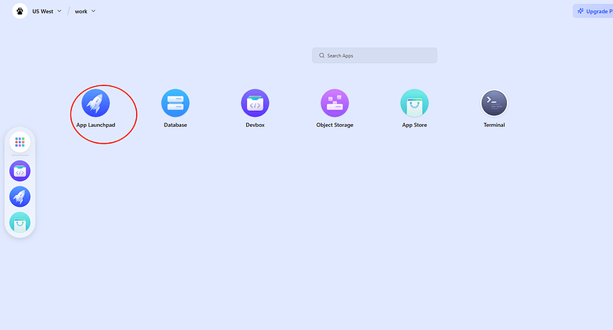
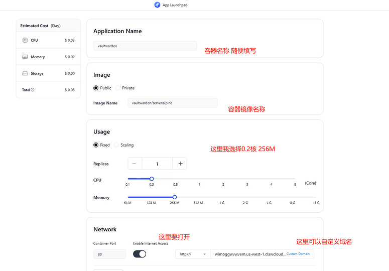
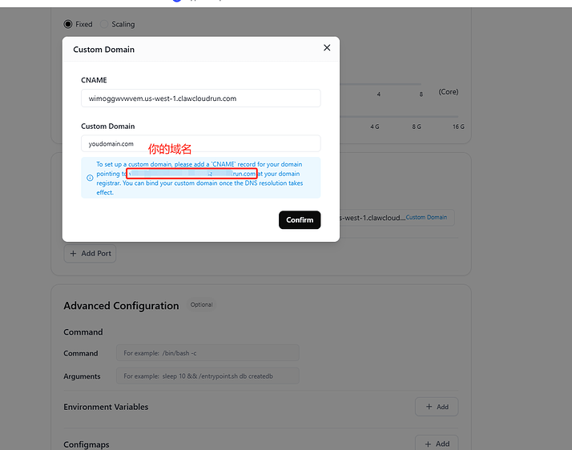
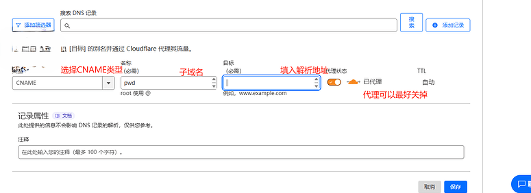
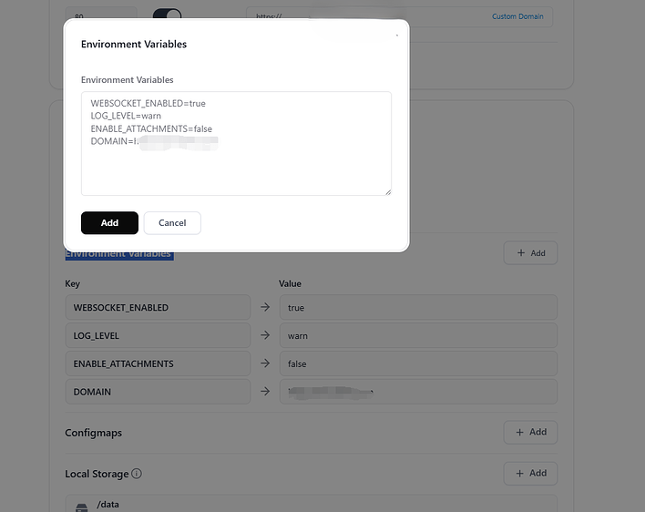
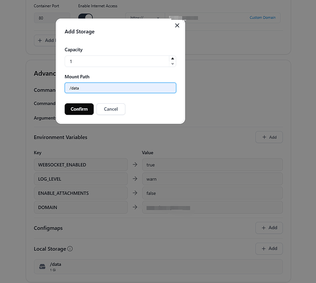

这种单纯的云容器服务单纯跑一些小东西感觉比云服务方便多了。

<!-- truncate -->

最近准备把自己的NAS卖了。昨天刚刚拆掉NAS，今天还在想我的vaultwarden怎么搞呢？就在各大论坛搜索有没有免费的vps。<del>我才不会说申请了半年的甲骨文一直abc🤣</del>

就看到ClawCloud的帖子，我寻思这不正是我需要的吗？

> Devbox 是 ClawCloud 新出品的开发容器，使用 Github 账号联合登录，即可获得每月 $5 的免费额度（无需信用卡）。
> 最高 4 核 8G，10G 硬盘，10G 流量，多个地区选择，
> 与 VPS 相比，流量偏少，更适合临时开发，或低频率访问。

说搞就搞，全程10分钟搞定，将自己的密码库导入测试重启容器ok没有问题 将手机和电脑的服务替换。拿下！

下面是详细步骤😁：

1. 第一步肯定是注册账号了，我是直接用GitHub登录的地址在这可以走我aff https://console.run.claw.cloud/signin?link=9QQHFFY8T569 <del>虽然我也不知道这个aff有啥用</del>

2. 选择`App Launchpad` 点 `Create APP`
   

3. 配置容器
   

   根据官网和社区查看资料得知,所以我设置了0.2核256M这样一天是`0.05$*30天=1.5$` 我可真是省钱小能手啊🤣

   > 运行 Vaultwarden + SQLite，1-2 用户，内存占用约 100MB，CPU 使用率 \<5%。
   > 单用户内存占用：
   >   * Vaultwarden（SQLite 数据库）：约 30-50MB（空闲），100MB（活跃时）。
   >   * WebSocket（若启用）：额外 10-20MB。
   >   * 操作系统（轻量级，如 Alpine Linux）：50-100MB。
   >   * 反向代理（如 Nginx，若使用）：10-20MB。

   默认会生成一个域名，也可以自定义自己的域名。我选择自定义域名，是用的cloudflare
   
   
   `Environment Variables `点击add按钮填入以下内容：

   ```yaml
   WEBSOCKET_ENABLED=true # 启用 WebSocket（可设为 false 降低内存）
   LOG_LEVEL=warn  # 减少日志输出
   ENABLE_ATTACHMENTS=false # 禁用附件，降低资源需求
   DOMAIN=https://xxxx.com  # 替换为你的域名
   ```
   

   `Local Storage`选择add添加映射目录持久化数据
   

4. 点击`Deploy Application` 等待启动成功，大功告成~！
5. 通过你自己的域名或者免费的域名访问，然后测试一下功能没问题，记得创建个密码然后重启容器看看功能是否正常来测试数据有没有持久化成功。

