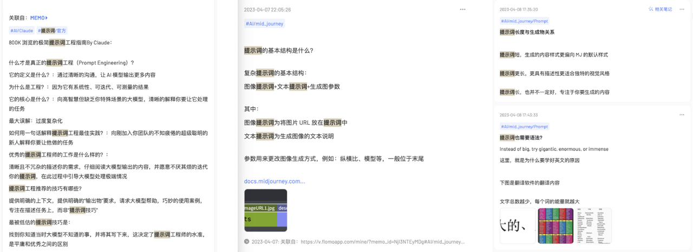
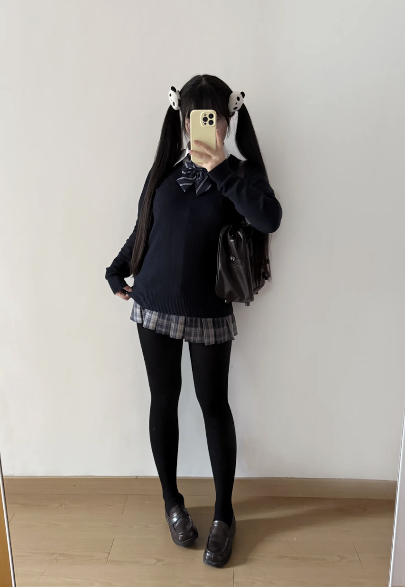
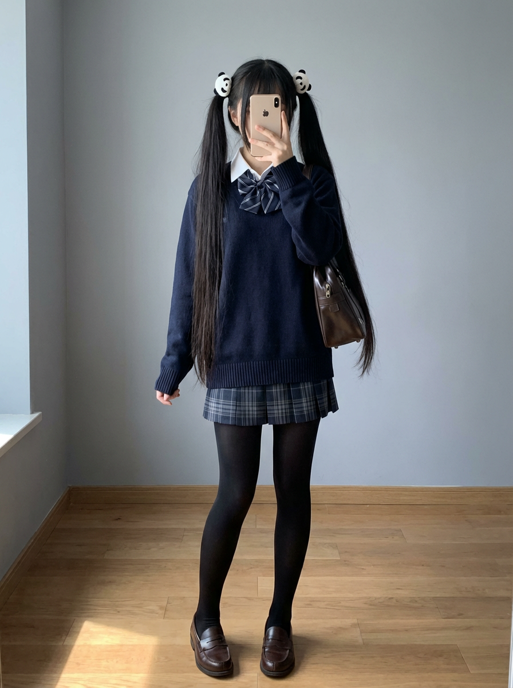
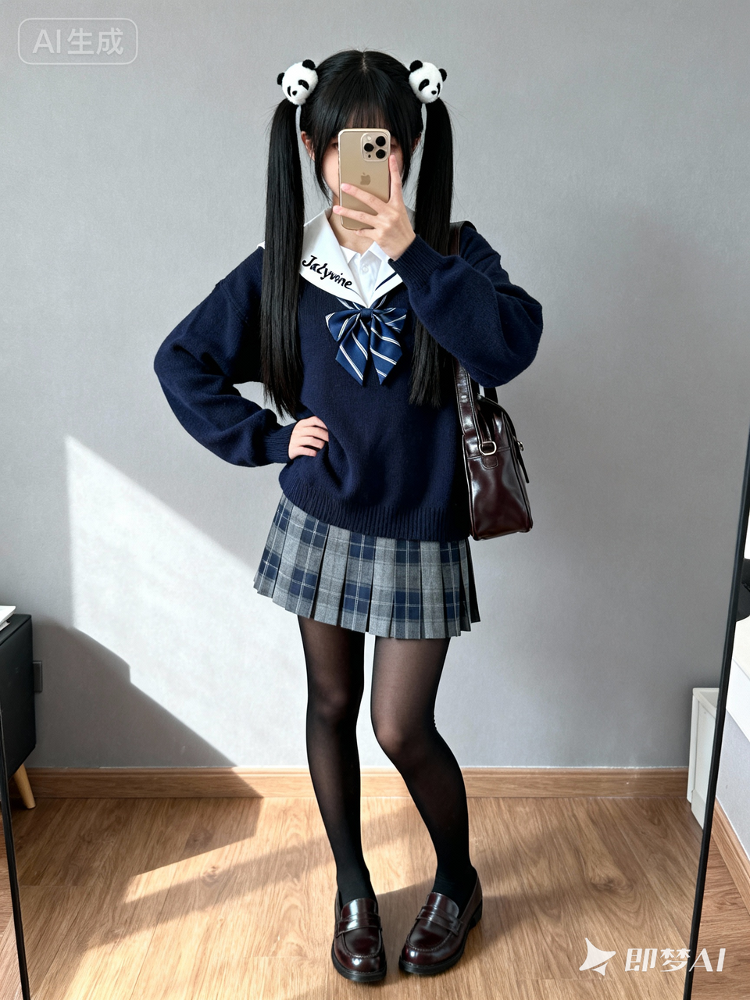
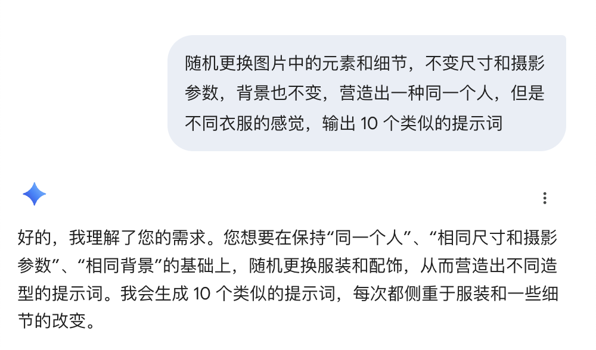
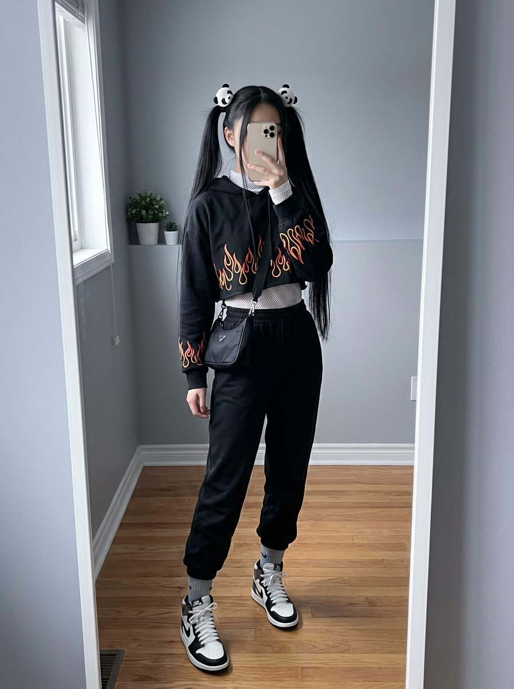

> [!NOTE]
>
> 原文：https://ai.feishu.cn/wiki/OKvFwmmaIiBlPYkDGo3c8Z0EnCE

昨天发的公众号，说了，刚开始，我是真的去学了各种提示词框架，什么 PAIN 什么 STAR，我是真的以为“写 Prompt 就像写代码，要越详细越好。”



但随着模型越来越强，你会发现另一件事：

> **最有效、最高产、最容易上手的提示词，往往是最简单的那一句。**

（注意啊，一定要是推理模型）[到底什么是推理模型？](https://dqxf1izhlm.feishu.cn/wiki/Ulzlwnqx3ilx9Gk01T2cQqmynAf)

我后面发现，像我这样的懒人，就适合这一个技巧

 **这个技巧可以实现：用最少的努力，借助 AI 的力量，输出结构化提示词，让 AI 输出的内容质量成倍提高**

 **Lazy Prompt！**

那么啥是 Lazy Prompt 呢？

传统提示词：

> 你告诉模型怎么做。

Lazy Prompt：

> 你告诉模型“要什么结果”，让它自己决定“怎么做”。

这像是：

- 传统 Prompt = “你写代码”
- Lazy Prompt = “你提需求，AI 写方案 + 写代码”

我一般让 AI 开始写作、编程等复杂任务前，我会先这样

```Plain
优化提示词：「这里写你的口语化提示词」
```

比如，我要写个微信公众号：

我不会直接让 AI 写个微信公众号文章，而是让 AI 先优化我的提示词：

```JSON
优化提示词：输出一篇爆款微信公众号文章
```

就这一步，AI 的输出质量大幅度提高

```JSON
角色与目标： 你是一位拥有 5年+、了解年轻人心理 经验的微信公众号爆款文章撰稿人。你的目标是撰写一篇在 追求个人成长和事业发展的白领/职场新人 中能达到 10万+ 阅读量、高转发率、高点赞收藏的爆款文章。
主题与核心价值：
文章核心主题： 如何利用碎片化时间实现职场技能的指数级提升，避免“瞎忙”陷阱。
核心论点/观点： 90%的人只注重“时间管理”，但真正的秘密在于“精力颗粒度管理”——将高价值任务拆解到15分钟内完成。
用户能获得的价值： 掌握一套全新的“15分钟高能工作法”，每天多出2小时专注时间，实现半年内从“初级”到“资深”的跨越。
结构与风格要素： 4.  文章标题要求： 必须使用 数字吸引、对比悬念 风格，包含 碎片时间、效率 关键词，字数在 18-22 字之间，提供 5个 备选。 5.  文章结构： 必须包含以下 5个 关键部分： * 开头： 用一个你亲身经历的“无效努力”小故事 抓住读者。 * 主体 1 (痛点)： 深入剖析 职场白领 在 工作看似努力却无进展 上的 “总在瞎忙”的深深无力感。 * 主体 2 (解药)： 提供 3个 实用、可操作、独家的解决方案/方法论，重点讲解“精力颗粒度”如何操作。 * 案例/数据支持： 至少引用 1个 利用此方法成功晋升的真实用户案例来增强说服力。 * 结尾： 总结核心观点，并给出 一个互动性强的问题：你今天打算用15分钟完成哪个高价值任务？ 6.  写作语气/风格： 使用 真诚、直接、略带启发性 的语气，避免使用 假大空的励志口号。 7.  排版要求： 多使用 加粗重点、Emoji符号（如🚀💡🎯）、分段小标题（如：第一招：打破“完整时间”迷思），使文章内容易于阅读和传播。
输出要求：
先输出 5个 标题。
然后输出正文。总字数控制在 2500-3000 字。
在文章末尾，请附上一个适合作为配图的描述词，关键词包括 ：一个年轻白领、高效工作、咖啡、笔记本电脑、星空、充满能量、未来感。
```

为啥？

很多人用AI时都陷入“信息过载”误区，觉得写得越详细越好，却忽略了AI的核心需求——**明确的核心目标+清晰的场景边界**，而非杂乱无章的信息堆砌

而这个办法，就是很好的帮助我们利用 AI 自己的能力：任务、模式归纳和自我拓展

AI 自己来：推断你想要什么、设计结构、优化逻辑、选择写作风格、自动扩展深度、输出一个“接近最优解”的结果，我就问问以上这些环节，谁会做的比 AI 好，谁会在同样质量下比 AI 快？

 **试用场景也很广**

几乎适用于所有“创作类”“结构化输出”的任务：

- 写文章
- 写论文
- 写脚本
- 写帖子
- 写计划书
- 写商业报告
- 生成运营方案
- 生成 PPT 大纲
- 课程设计
- 产品文案
- 故事/营销文案
- 数据分析结论

它的核心。就是把绝大部分结构化的任务拆解、输出格式、写作目标……全部交给 AI 自己决定，而不是你来写

当然了，如果你需要更加精确的，让 AI 按照你的设计行动，还是要学习专业的 PE，以及 Spec

但是对于小白用户，Lazy Prompt 绝对是最佳入门首选

**最后，还有一招**

```Plain
请你自我优化，充分运用批评与自我批评这个武器，然后给出更好的版本
```

这，是一个已经有十几个友友反馈，真实好用的提示词技巧！

经过了这一招，谷歌终于给了我一个一劳永逸的提示词技巧：

```Plain
请你不要执行接下来的任务。你现在的身份是世界顶级的提示工程专家，请仔细阅读我提供的【初始提示词】，并从清晰度、专业度、结构化、模型适应性四个维度进行批判性优化。请仅输出优化后的提示词内容，并用 ``` 包裹起来。
```

我道心破碎了，这个方法其实不叫 Lazy Prompt，其实叫：**两步提示法 (Two-Step Prompting)**

更有友友告诉我，这个技巧，吴恩达老师的提示词第二课就已经讲过了，哭了

 **JK 老师！图像，也可以这样用吗？**

我的朋友，当然可以

提示词我还在优化，你可以拿这个加你在网上找到的任何一张图，发给 AI 让 AI 描述出 JSON 格式的提示词

案例：

小红书：@蛋挞大王



效果BY Nanobanana：

 **元提示：**

```Plain
详细描述完整的图像复刻 JSON 提示词，包含物体、服装、头发、细节、配饰、摄像设备、环境、灯光、风格、身体动态，一切都要详细复刻原图，最终输出一个优化的元提示词， 800 字
```




```Plain
{
  "canvas": {
    "aspect_ratio": "3:4",
    "framing": "full body centered, small headroom and side breathing room",
    "mirror_selfie": true
  },
  "subject": {
    "identity": "young East Asian woman",
    "age_range": "18-24",
    "build": "slim, average height",
    "pose": {
      "stance": "natural upright, slight weight shift to one leg",
      "legs": "parallel, straight, feet slightly apart",
      "right_arm": "bent, holding phone in front of face, fully covering features",
      "left_arm": "relaxed,微微拉拽毛衣下摆或贴近臀侧",
      "head": "微低头，视线对准手机"
    },
    "face": {
      "visibility": "hidden_by_phone",
      "skin_tone_hint": "light, neutral"
    }
  },
  "hair": {
    "length": "very long, to hips",
    "color": "pure black, no highlights",
    "style": "high twin ponytails, center part",
    "texture": "straight, sleek, slight volume",
    "accessories": [
      {
        "type": "plush hair clip",
        "shape": "panda",
        "color": "white with black ears and eyes",
        "position": "at base of each ponytail near crown"
      }
    ]
  },
  "wardrobe": {
    "top_inner": {
      "item": "white shirt",
      "collar": "pointed collar exposed",
      "fabric": "cotton, smooth"
    },
    "top_outer": {
      "item": "knit sweater",
      "color": "dark navy (near black)",
      "fit": "slightly loose, covers hips",
      "neckline": "round",
      "cuffs_hem": "ribbed cuffs and ribbed hem",
      "finish": "matte, fine-knit, no logo"
    },
    "neck_accessory": {
      "item": "bow tie",
      "pattern": "navy with light diagonal stripes",
      "style": "Japanese school uniform"
    },
    "skirt": {
      "type": "pleated mini skirt",
      "length": "mid-thigh",
      "pattern": "tartan plaid",
      "colors": "grey + navy, subtle lighter stripes",
      "shape": "平整下垂，褶线清晰，轻微双层边感"
    },
    "legwear": {
      "type": "tights",
      "color": "solid black",
      "opacity": "opaque",
      "finish": "matte, no sheen"
    },
    "shoes": {
      "type": "loafers",
      "color": "dark brown (near black)",
      "material": "polished leather",
      "toe": "round",
      "heel": "low",
      "details": "简洁鞋面缝线，轻微使用痕迹"
    }
  },
  "accessories": {
    "bag": {
      "type": "shoulder bag",
      "carry": "right shoulder",
      "position": "bag rests along right torso, partly behind arm",
      "color": "dark coffee brown",
      "material": "leather, slightly glossy",
      "structure": "semi-structured, flap with hardware hint"
    },
    "phone": {
      "type": "smartphone",
      "finish": "champagne gold / light beige back",
      "orientation": "vertical",
      "function": "covers face completely"
    }
  },
  "environment": {
    "location": "minimalist indoor room",
    "wall": {
      "color": "cool light gray/off-white",
      "surface": "smooth, no decor"
    },
    "floor": {
      "material": "wood",
      "tone": "warm oak",
      "details": "visible plank joints and subtle grain"
    },
    "extras": "no furniture, no clutter, thin mirror frame edge faintly at sides"
  },
  "lighting": {
    "type": "soft natural daylight / diffused",
    "direction": "from left side (off-frame window)",
    "shadows": "very soft, slight shadow on floor behind/right of legs",
    "white_balance": "neutral-cool",
    "contrast": "low to medium"
  },
  "camera": {
    "mode": "mirror selfie",
    "fov_equivalent": "24-28mm",
    "angle": "eye-level to slightly low",
    "focus": "sharp on clothing textures and hair, background slightly softer",
    "render_intent": "photorealistic smartphone quality"
  },
  "color_palette": {
    "dominant": ["#101826 (dark navy)", "#000000 (black)", "#3A2F2A (dark brown)"],
    "secondary": ["#DCDCDD (cool light gray wall)", "#6A7280 (grey plaid)", "#C99A62 (warm oak floor)"],
    "overall_tone": "neutral-cool with warm floor accent"
  },
  "body_dynamics": {
    "stability": "relaxed and steady",
    "gesture": "right arm up with phone, left arm relaxed",
    "balance": "slight hip shift, both feet flat"
  },
  "composition_rules": {
    "include_full_body": true,
    "keep_face_obscured_by_phone": true,
    "retain_plain_background": true,
    "avoid_extra_objects": true,
    "center_subject": true,
    "mirror_reflection_correct": true
  },
  "negatives": [
    "do not reveal face or eyes",
    "no shiny/glossy tights",
    "no extra furniture/props",
    "avoid bright or saturated plaid colors",
    "no studio backdrops or dramatic lighting",
    "avoid bangs/fringe covering forehead; keep center part visible",
    "no wide-angle distortion"
  ],
  "output_goal": "high-fidelity recreation of outfit, hairstyle, pose and minimalist room as a realistic 3:4 portrait mirror selfie"
}
```

看来，AI 的生成能力和顶级的博主还是差的远

即梦的效果：



```JSON
照片级真实感，全身镜面自拍 (Mirror selfie), 3:4 构图，主角是 16-18 岁东亚女性，155cm身高， 60KG体重，站在极简冷灰墙壁和温暖橡木地板的室内 
姿势：自然站立，自然向右扭偏髋，右臂弯曲将香槟金手机竖向举在面部前方，完全遮住脸部；左臂放松，轻微拉拽深海军蓝圆领毛衣下摆 
发型：超长纯黑色直发，高双马尾，中分，每个马尾根部佩戴一个白色带黑色耳朵的熊猫毛绒发夹。 
服装：深海军蓝（近黑）宽松细针织毛衣，内搭露出尖领的白衬衫（领子上有小字刺绣：Jackywine），水手服蓝斜纹领结，灰色+海军蓝格子百褶短裙，纯黑色不透明超厚哑光连裤袜，深棕色抛光皮革圆头乐福鞋 
配饰：右肩背深咖啡棕色皮革半硬挺单肩包 
光线：柔和漫射日光从左侧照射，形成中性偏冷、低对比度的氛围 
焦距 24-28mm，对焦在服装和发型质感上，背景略柔和 
Negative Prompt: 不要显示面部或眼睛，光泽连裤袜，无刘海，无广角畸变，避免明亮饱和的格子颜色，无影棚背景，无额外家具或道具
```

还不错？

继续！





```JSON
照片级真实感，全身镜面自拍 (Mirror selfie), 3:4 构图，主角是 16-18 岁东亚纤瘦女性，站在极简冷灰墙壁和温暖橡木地板的室内。姿势：站姿略微放松，右臂弯曲将香槟金手机竖向举在面部前方，完全遮住脸部；左手自然插在黑色宽松运动束脚裤的侧袋中。发型：超长纯黑色直发，高双马尾，中分，每个马尾根部佩戴一个熊猫毛绒发夹。服装：火焰图案黑色短款卫衣，内搭白色高领网纱打底衫（袖子露出），黑色宽松运动束脚裤，灰色短袜，白色及黑色的高帮运动鞋。配饰：右肩背迷你黑色尼龙腰包（斜挎胸前）。光线：柔和漫射日光从左侧照射，形成中性偏冷、低对比度的氛围。
```


```JSON
照片级真实感，全身镜面自拍 (Mirror selfie), 3:4 构图，主角是 16-18 岁东亚纤瘦女性，站在极简冷灰墙壁和温暖橡木地板的室内。姿势：自然站立，重心略微向右扭转，自然的放松姿势，右臂弯曲将香槟金手机竖向举在面部前方，完全遮住脸部；左手轻扶墨绿色菱格纹毛衣马甲的下摆。发型：超长纯黑色直发，高双马尾，中分，每个马尾根部佩戴一个熊猫毛绒发夹。服装：墨绿色菱格纹 V 领毛衣马甲，内搭白色宽松七分袖衬衫，焦糖棕色 A 字短裙，白色针织长筒袜 (至膝盖)，黑色牛津鞋。配饰：右肩背深棕色剑桥包。光线：柔和漫射日光从左侧照射，形成中性偏冷、低对比度的氛围。
```

 **下面的，自己尝试，我就不放图了哈**

```JSON
照片级真实感，全身镜面自拍 (Mirror selfie), 3:4 构图，主角是 16-18 岁东亚纤瘦女性，站在极简冷灰墙壁和温暖橡木地板的室内。姿势：直立站姿，双腿前后交叉，右臂弯曲将香槟金手机竖向举在面部前方，完全遮住脸部；左手轻搭在米白色修身西装外套的腰部。发型：超长纯黑色直发，高双马尾，中分，每个马尾根部佩戴一个熊猫毛绒发夹。服装：米白色修身小西装外套，内搭丝质黑色吊带背心，配套的米白色西装短裤，黑色透明薄丝袜，黑色低跟尖头鞋。配饰：右肩背象牙白皮革链条包。光线：柔和漫射日光从左侧照射，形成中性偏冷、低对比度的氛围。
```

```JSON
照片级真实感，全身镜面自拍 (Mirror selfie), 3:4 构图，主角是 16-18 岁东亚纤瘦女性，站在极简冷灰墙壁和温暖橡木地板的室内。姿势：直立站姿，双腿前后交叉，右臂弯曲将香槟金手机竖向举在面部前方，完全遮住脸部；左手轻搭在腰部。发型：超长纯黑色直发，高双马尾，中分，每个马尾根部佩戴一个熊猫毛绒发夹。服装：纯黑色镂空性感原宿连体衣女式露肩街头服饰派对俱乐部连体毛衣，黑色透明薄丝袜，黑色低跟尖头鞋。配饰：右肩背象牙白皮革链条包。光线：柔和漫射日光从左侧照射，形成中性偏冷、低对比度的氛围。
```

 **即梦：**

```JSON
照片级真实感，全身镜面自拍 (Mirror selfie), 3:4 构图，主角是 16-18 岁东亚纤瘦女性，站在极简冷灰墙壁和温暖橡木地板的室内。姿势：直立站姿，双腿前后交叉，右臂弯曲将香槟金手机竖向举在面部前方，完全遮住脸部；左手轻搭在腰部。发型：超长纯黑色直发，高双马尾，中分，每个马尾根部佩戴一个熊猫毛绒发夹。服装：纯黑色镂空性感原宿连体衣女式露肩街头服饰派对俱乐部连体毛衣，超低腰宽松黑色工装裤,黑色透明薄丝袜，黑色皮靴。配饰：右肩背象牙白皮革链条包。光线：柔和漫射日光从左侧照射，形成中性偏冷、低对比度的氛围。
```