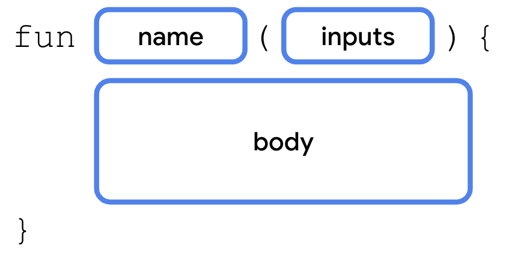
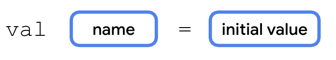
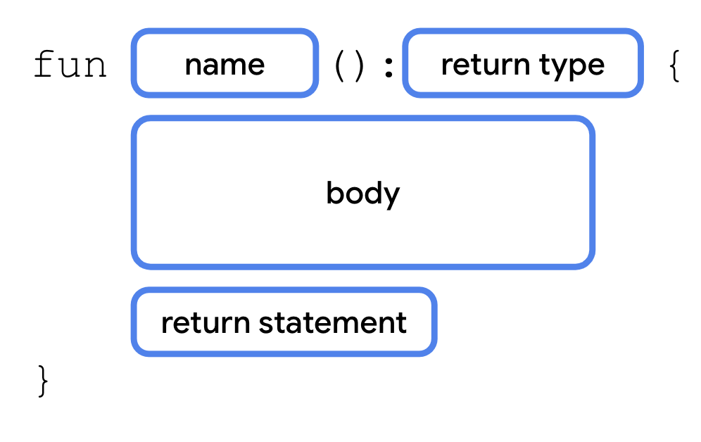
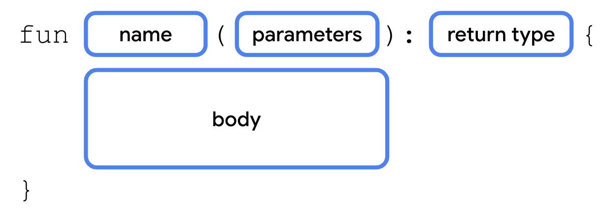

## 定义函数

- 函数需要有**名称**，这样您以后才能调用它。
- 函数还可能需要一些**输入**或需要在调用函数时提供的信息。函数要利用这些输入来实现其目的。输入并非硬性要求，有些函数不需要输入。
- 函数还要有**主体**，其中包含执行任务的指令

```kotlin
fun main() {
    println("Hello, Android!")
}
```





## 数据类型

在决定应用的哪些部分可变时，请务必指定可在这些变量中存储的数据类型。在 Kotlin 中，有一些常见的基本数据类型。下表逐行列明了各种不同的数据类型，并针对每种数据类型提供了可存储数据类型的说明和示例值。

| **Kotlin 数据类型** | **可包含的数据类型**                                         | **字面量值示例**                       |
| ------------------- | ------------------------------------------------------------ | -------------------------------------- |
| `String`            | 文本                                                         | `"Add contact"` `"Search"` `"Sign in"` |
| `Int`               | 整数                                                         | `32` `1293490` `-59281`                |
| `Double`            | 小数                                                         | `2.0` `501.0292` `-31723.99999`        |
| `Float`             | 小数（不如 `Double` 精确），数字末尾带有 `f` 或 `F`。        | `5.0f` `-1630.209f` `1.2940278F`       |
| `Boolean`           | `true` 或 `false`。当只有两个可能的值时，可使用此数据类型。请注意，`true` 和 `false` 是 Kotlin 中的关键字。 | `true` `false`                         |

**注意**：如需了解数值数据类型（`Int`、`Double` 和 `Float`）的有效范围，请参阅[数字](https://kotlinlang.org/docs/numbers.html)部分中的说明。如需详细了解 `Double` 和 `Float` 之间的区别，请查看[这个表格](https://kotlinlang.org/docs/numbers.html#floating-point-types)中对这两种数据类型进行的对比。

## 定义与使用变量

```kotlin
fun main() {
    val count: Int = 2
    println(count)
}
```

在变量名称后，需依次添加冒号、空格和变量的数据类型。如前所述，`String`、`Int`、`Double`、`Float,` 和 `Boolean` 是一些基本的 Kotlin 数据类型。

在变量声明中，等号 (`=`) 跟在数据类型之后。等号被称为赋值运算符。赋值运算符用于为变量赋值。换句话说，等号右侧的值会存储在等号左侧的变量中。


### 字符串模板

该模板表达式由美元符号 (`$`) 后跟一个变量名组成。系统会对模板表达式求值，并将值换入到字符串中。

`+` 符号用于串联各个字符串，也可用于将其他数据类型的变量（如 `Int` 和 `Boolean`）串联到 `Strings`。

转义序列是指前面带有反斜杠符号（`\`，也称为转义反斜杠）的字符。

```kotlin
fun main() {
    val count: Int = 2
    println("You have $count unread messages.")
}
```

```kotlin
fun main() {
    val trip1: Double = 3.20
    val trip2: Double = 4.10
    val trip3: Double = 1.72
    val totalTripLength: Double = trip1 + trip2 + trip3
    println("$totalTripLength miles left to destination")
}
```

```ko
fun main() {
    val nextMeeting = "Next meeting: "
    val date = "January 1"
    val reminder = nextMeeting + date + " at work"
    println(reminder)
}
```

```ko
fun main() {
    println("Say \"hello\"")
}
```


### 类型推断

利用类型推断，当 Kotlin 编译器可以推断（或确定）变量应属的数据类型时，不必在代码中写入确切类型。这意味着，如果为变量提供了初始值，就可以在变量声明中省略数据类型。Kotlin 编译器会查看初始值的数据类型，并假定变量会存储该类型的数据。

```kotlin
val count = 2
```




### 整数的基本数学运算

将整数存储为 `Int`（而不是 `String`）的优势在于，可以使用 `Int` 变量执行数学运算，例如加法、减法、除法和乘法（请参阅其他[运算符](https://kotlinlang.org/docs/keyword-reference.html#operators-and-special-symbols)）。例如，可将两个整数变量相加，得出它们的总和。

```kotlin
fun main() {
    val unreadCount = 5
    val readCount = 100
    println("You have ${unreadCount + readCount} total messages in your inbox.")
}
```

如果使用更复杂的表达式，就必须用大括号将该表达式括起来，并在大括号前添加 `$` 符号：`${unreadCount + readCount}`。

### 更新变量

如果需要更新变量的值，请使用 Kotlin 关键字 `var`（而不是 `val`）声明该变量。

- `val` 关键字 - 预计变量值不会变化时使用。
- `var` 关键字 - 预计变量值会发生变化时使用。

```kotlin
fun main() {
    val cartTotal = 0
    cartTotal = 20
    println("Total: $cartTotal")
}

fun main() {
    var cartTotal = 0
    cartTotal = 20
    println("Total: $cartTotal")
}
```

增量运算符 (`++`) 和减量运算符 (`--`) 更新可变变量。更具体地说，`count++` 等同于 `count = count + 1`，`count--` 等同于 `count = count - 1`。

## 添加注释

```kotlin
// This is a comment.
```

```kotlin
/*
 * This is a very long comment that can
 * take up multiple lines.
 */
```

## 调用函数

```ko
fun main() {
    birthdayGreeting()
}

fun birthdayGreeting() {
    println("Happy Birthday, Rover!")
    println("You are now 5 years old!")
}
```

### 从函数返回值



#### `Unit` 类型

默认情况下，如果不指定返回值类型，默认返回值类型是 `Unit`。`Unit` 表示函数并不会返回值。`Unit` 相当于其他语言中的 void 返回值类型（在 Java 和 C 中为 `void`；在 Swift 中为 `Void`/空元组 `()`；在 Python 中为 `None` 等）。任何不返回值的函数都会隐式返回 `Unit`。

```ko
fun main() {
    birthdayGreeting()
}

fun birthdayGreeting(): Unit {
    println("Happy Birthday, Rover!")
    println("You are now 5 years old!")
}
```

#### 返回 `String`

```kotlin
fun main() {
    val greeting = birthdayGreeting()
    println(greeting)
}

fun main() {
    println(birthdayGreeting())
}

fun birthdayGreeting(): String {
    val nameGreeting = "Happy Birthday, Rover!"
    val ageGreeting = "You are now 5 years old!"
    return "$nameGreeting\n$ageGreeting"
}
```

## 添加形参

形参会指定变量的名称和数据类型，可以将其作为要在函数内访问的数据传递到函数中。形参在函数名称后面的圆括号内进行声明。



```kotlin
fun main() {
    println(birthdayGreeting("Rover"))
}

fun birthdayGreeting(name: String): String {
    val nameGreeting = "Happy Birthday, $name!"
    val ageGreeting = "You are now 5 years old!"
    return "$nameGreeting\n$ageGreeting"
}
```

> **注意：**尽管您经常会发现形参和实参可互换使用，但这两者并不是一回事。定义函数时，您需定义要在调用该函数时向它传递的形参。调用函数时，您需要为形参传递实参。形参是可供函数访问的变量（例如 `name` 变量），而实参是您传递的实际值（例如 `"Rover"` 字符串）。
>
> **警告**：与某些语言（例如在 Java 中，函数可以更改传递到形参中的值）不同，Kotlin 中的形参是不可变的。您不能在函数主体中重新分配形参的值。

### 多个形参的函数

形参定义以英文逗号分隔。同样，当调用具有多个形参的函数时，也需使用英文逗号分隔传入的实参。


```kotlin
fun main() {
    println(birthdayGreeting("Rover", 5))
    println(birthdayGreeting("Rex", 2))
}

fun birthdayGreeting(name: String, age: Int): String {
    val nameGreeting = "Happy Birthday, $name!"
    val ageGreeting = "You are now 5 years old!"
    return "$nameGreeting\n$ageGreeting"
}
```

### 函数签名

函数名称及其输入（形参）统称为“函数签名”。函数签名包含返回值类型前面的所有内容，如以下代码段所示。

```
fun birthdayGreeting(name: String, age: Int)
```

形参（以英文逗号分隔）有时称为形参列表。

对于其他开发者编写的代码，经常会在其文档中看到这些术语。通过函数签名，可以了解函数的名称以及可以传入的数据类型。

## 具名实参

在调用函数时添加了形参名称，该名称就称为[具名实参](https://kotlinlang.org/docs/functions.html#named-arguments)。即使更改了实参的顺序，系统也会为相同的形参传入相同的值。

```ko
println(birthdayGreeting(name = "Rex", age = 2))
```

## 默认实参

可以指定默认实参，以便在调用函数时省略该实参。

如需添加默认实参，可以在形参的数据类型后面添加赋值运算符 (`=`)，并将其设为等于某个值。

```k
fun main() {
	println(birthdayGreeting(age = 5))
	println(birthdayGreeting("Rex", 2))
}

fun birthdayGreeting(name: String = "Rover", age: Int): String {
    return "Happy Birthday, $name! You are now $age years old!"
}
```

