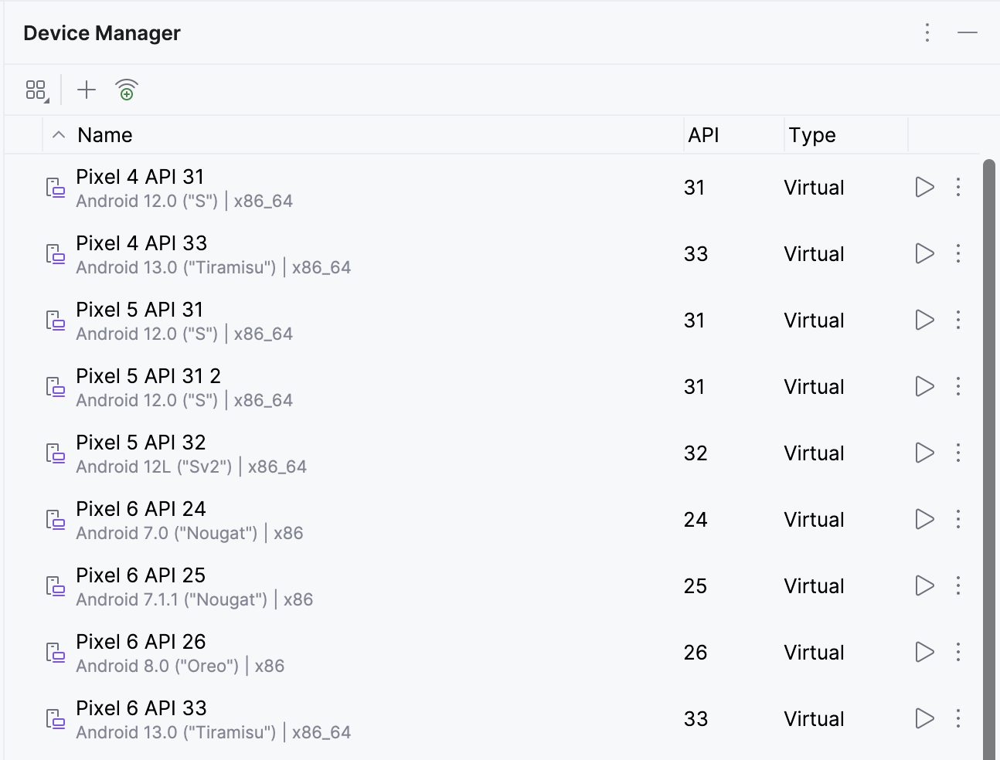
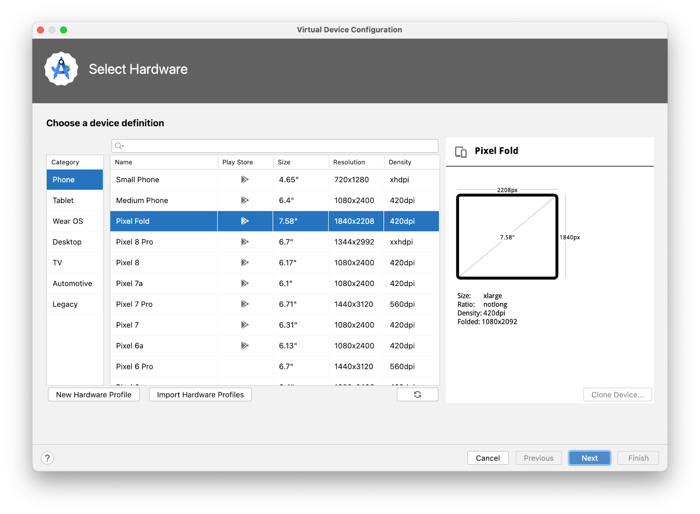
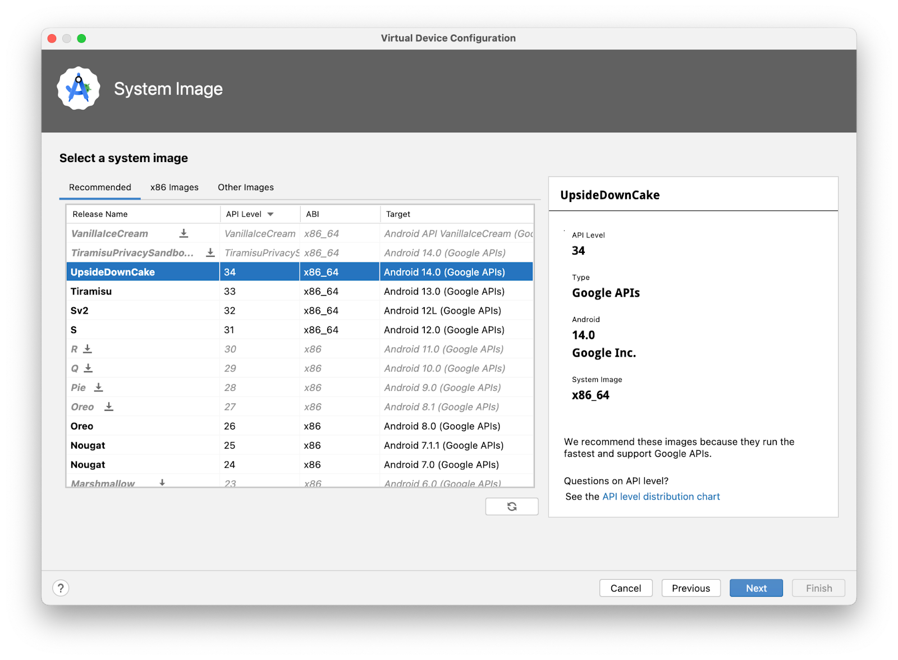
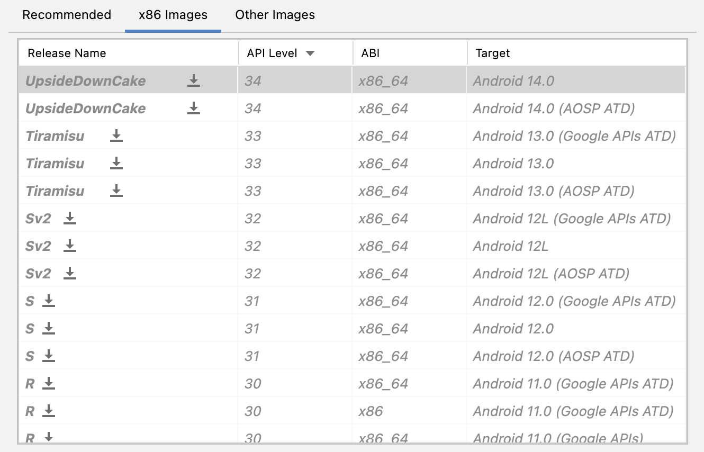
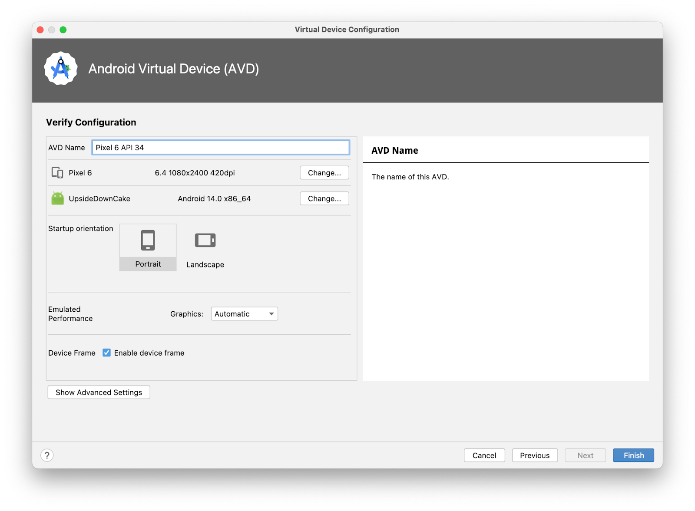
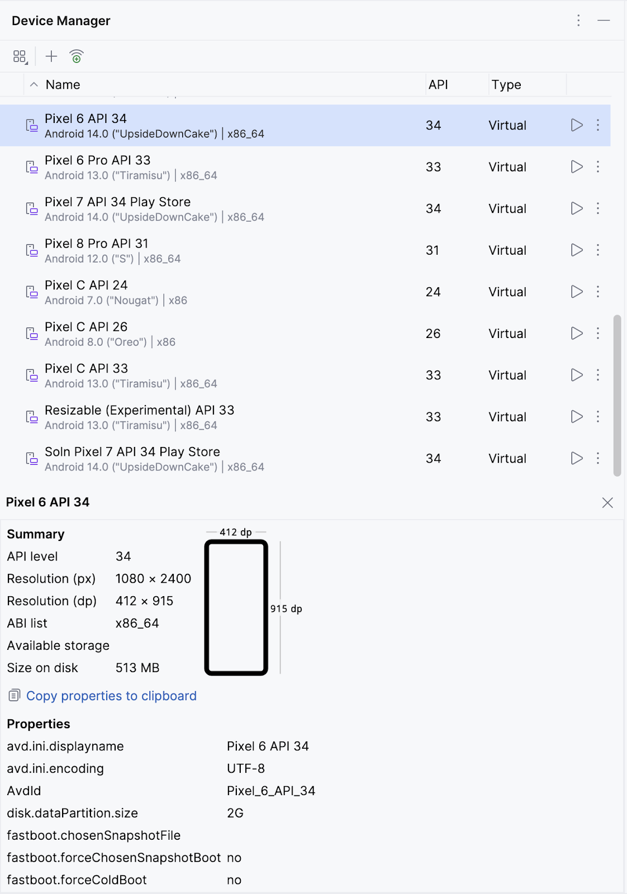
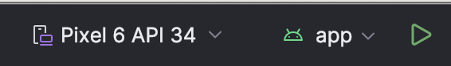
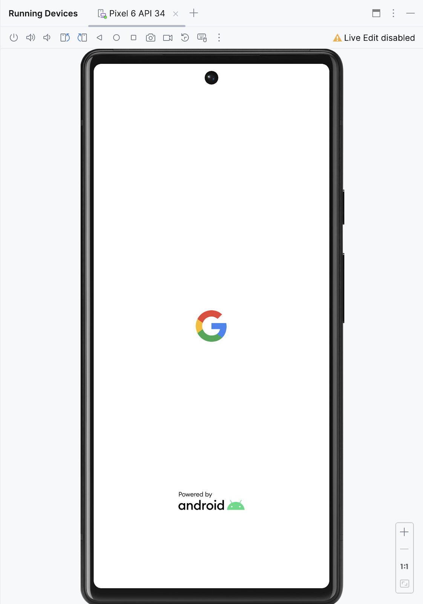
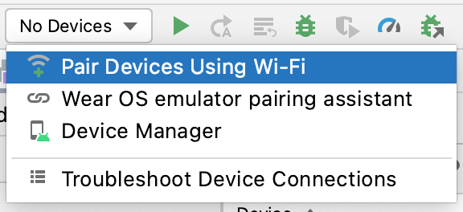
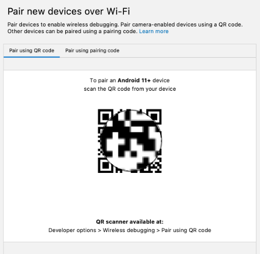

## 在 Android 模拟器上运行应用

> 使用[设备管理器](http://developer.android.com/tools/devices/managing-avds.html?hl=zh-cn)来创建 Android 虚拟设备 (AVD)。AVD 是移动设备的软件版本（也称为模拟器），可在计算机上运行，以及模拟特定类型 Android 设备的配置。它可以是任何手机、平板电脑、电视、手表或 Android Auto 设备。如果您遇到任何问题，请参阅[在 Android 模拟器上运行应用](https://developer.android.com/studio/run/emulator.html?hl=zh-cn#Requirements)。

### 创建 AVD

1. 在 Android Studio 中，依次选择 **Tools > Device Manager**。系统随即会打开 **Device Manager** 对话框。如果以前创建过虚拟设备，则此对话框中会列出该设备。

   

2. 点击 + **Create virtual device**。系统随即会显示 **Virtual Device Configuration** 对话框。

   

   该对话框会显示一个预配置设备的列表（按类别整理），可以从中选择。对于每种设备，该表都提供了相应列来分别表明其显示大小（以英寸为单位）、屏幕分辨率（以像素为单位）和像素密度（每英寸像素数）。

   1. 选择 **Phone** 类别。
   2. 选择所需手机（例如 **Pixel 6**），然后点击 **Next**。

   此步骤会打开另一个屏幕，供您选择在虚拟设备上运行的 Android 版本。这可让您在不同版本的 Android 系统上测试您的应用。

   

3. 如果 **UpsideDownCake** 旁边显示下载链接，请依次点击 **Download > Accept > Next > Finish**。显示下载链接即表明您的计算机上未安装相关映像。在这种情况下，您必须先安装该映像，然后才能配置虚拟设备。下载过程需要一些时间才能完成。

4. 在 **Recommended** 标签页中，选择 **UpsideDownCake** 作为要在虚拟设备上运行的 Android 版本，然后点击 **Next**。

   > 如需查看稳定版的列表，请参阅[平台代号、版本、API 级别和 NDK 版本](https://source.android.com/setup/start/build-numbers?hl=zh-cn#platform-code-names-versions-api-levels-and-ndk-releases)。
   >
   > **重要提示**：这些 Android 系统映像会占用大量磁盘空间，因此您的原始安装中只会包含几个映像。**Recommended** 标签页中只显示了部分 Android 系统版本，除此之外，还有很多版本。如要查看这些版本的映像，请分别进入 **Virtual Device Configuration** 对话框中的 **x86 Images** 和 **Other Images** 标签页。
   >
   > 

5. 系统会打开另一个屏幕，您可以在其中为设备选择其他配置详情。

   

   > **注意**：如果看到有关将系统映像与 Google API 搭配使用的红色警告，可以暂时忽略它。

6. 在 **AVD Name** 字段中，输入 AVD 的名称，或使用默认名称。保持其余字段不变。

7. 点击**完成**。系统会返回到 **Device Manager** 窗格。

   

### 运行应用

1. 从 Android Studio 窗口顶部的下拉菜单中选择您创建的虚拟设备。

2. 点击运行按钮。虚拟设备的启动方式与实体设备类似。模拟器首次启动需要一些时间，有可能是几分钟。虚拟设备应该会在代码编辑器旁边打开。

   

3. 当应用准备就绪后，便会在虚拟设备上打开。

## 连接 Android 设备运行应用

### 启用 USB 调试

如要让 Android Studio 与您的 Android 设备通信，您必须在设备的“开发者选项”设置中启用 USB 调试功能。

如需显示开发者选项并启用 USB 调试功能，请按以下步骤操作：

1. 在 Android 设备上，依次点按**设置** > **关于手机**。
2. 连续点按**版本号**七次。
3. 如果出现提示，输入您的设备密码或 PIN 码。如果显示**您现在处于开发者模式！**消息，则说明您已成功启用开发者模式。

### 安装 Google USB 驱动程序（仅适用于 Windows

如果您在运行 Windows 系统的计算机上安装了 Android Studio，则必须先安装 USB 设备驱动程序，然后才能在实体设备上运行您的应用。

1. 在 Android Studio 中，依次点击 **Tools > SDK Manager**。系统随即会打开 **Preferences > Appearance & Behavior > System Settings > Android SDK** 对话框。
2. 点击 **SDK Tools** 标签页。
3. 选择 **Google USB Driver**，然后点击 **OK**。

完成后，驱动程序文件便会下载到 `android_sdk\extras\google\usb_driver` 目录中。现在，您可以连接设备并从 Android Studio 运行您的应用了。

### 通过数据线在 Android 设备上运行应用

您可以通过数据线或 Wi-Fi 这两种方式将设备连接到 Android Studio，也可以选择其他您更喜欢方式。

如需在 Android 设备上从 Android Studio 运行您的应用，请执行以下操作：

1. 使用 USB 线将 Android 设备连接到计算机。设备上应会显示一个对话框，要求您允许进行 USB 调试。

2. 选中**一律允许使用这台计算机进行调试**复选框，然后点按**确定**。

3. 在计算机上的 Android Studio 中，务必从下拉菜单中选择您的设备。

4. 选择您的设备，然后点击 **OK**。Android Studio 会在设备上安装并运行该应用。

   > **注意**：对于 Android Studio 3.6 及更高版本，当连接好已开启调试功能的实体设备后，系统会自动选择相应设备。

5. 如果您的设备运行的 Android 平台未在 Android Studio 中安装，并且系统显示消息来询问您是否要安装所需的平台，请依次点击 **Install > Continue > Finish**。Android Studio 会在设备上安装并运行该应用。

### 通过 Wi-Fi 在 Android 设备上运行应用

1. 确保您的计算机和设备已连接到同一无线网络。
2. 确保您的设备搭载的是 Android 11 或更高版本。如需了解详情，请参阅[查看并更新 Android 版本](https://support.google.com/android/answer/7680439?hl=zh-cn)。
3. 确保您的计算机已安装最新版本的 Android Studio。如需下载，请访问 [Android Studio](https://developer.android.com/studio?hl=zh-cn) 页面。
4. 确保您的计算机已安装最新版本的 [SDK 平台工具](https://developer.android.com/studio/releases/platform-tools?hl=zh-cn)。

#### 与设备配对

1. 在 Android Studio 中，从运行配置下拉菜单中选择 **Pair Devices Using Wi-Fi**。

   

2. 系统随即会打开 **Pair devices over Wi-Fi** 对话框。

   

3. 前往**开发者选项**，向下滚动到**调试**部分，然后开启**无线调试**。

4. 在**要允许通过此网络进行无线调试吗？**弹出式窗口中，选择**允许**。

5. 如需使用二维码配对您的设备，请选择**使用二维码配对设备**，然后在计算机上扫描该二维码。如需使用配对码配对您的设备，请选择**使用配对码配对设备**，然后输入 6 位数配对码。

> **注意**：如果您想与其他设备配对，或在计算机上取消保存此设备，请前往您设备上的**无线调试**，并在**已配对的设备**下点按工作站名称，然后选择**取消保存**。
