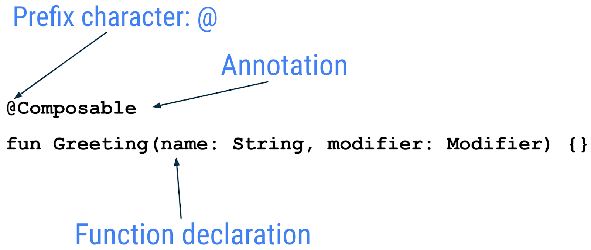
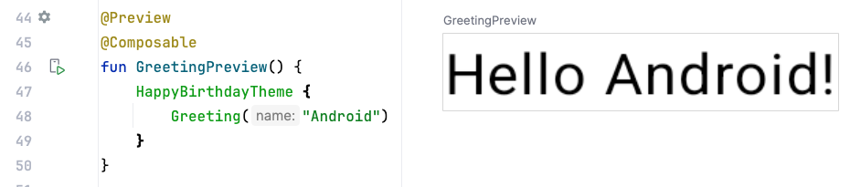
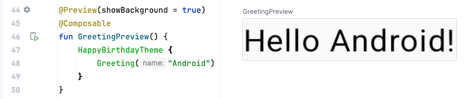
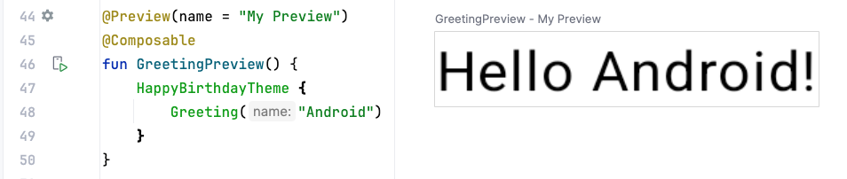
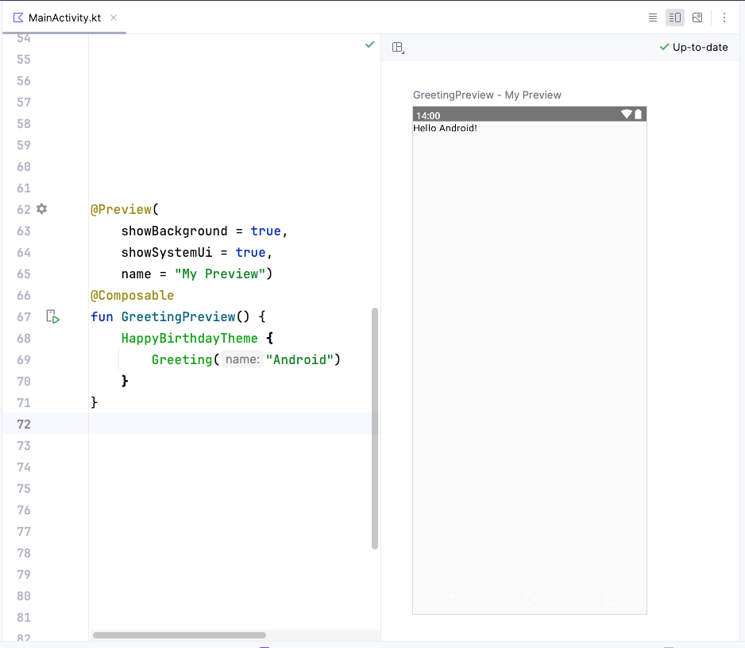

## 什么是 Jetpack Compose？

> Jetpack Compose 是用于构建 Android 界面的新款工具包。Compose 使用更少的代码、强大的工具和直观的 Kotlin 功能，可以帮助您简化并加快 Android 界面开发。借助 Compose，您可以通过定义一组函数来构建界面，这些函数称为可组合函数，它们会接受数据并描述界面元素。

### 可组合函数

在 Compose 中，可组合函数是界面的基本构建块。可组合函数：

- 描述界面中的某一部分。
- 不会返回任何内容。
- 接受一些输入并生成屏幕上显示的内容。

### 注解

注解是用于在代码中附加额外信息的方式。此类信息可以帮助 Jetpack Compose 编译器等工具和其他开发者理解应用的代码。

若要应用注解，只需在要注解的声明开头为其名称（注解）添加 `@` 字符作为前缀即可。您可以为包括属性、函数和类在内的不同代码元素添加注解。

下图是一个带有注解的函数示例：



以下代码段中包含一些带有注解的属性示例。

```kotlin
// Example code, do not copy it over

@Json
val imgSrcUrl: String

@Volatile
private var INSTANCE: AppDatabase? = null
```

### 带形参的注解

注解可以接受形参。形参可以为处理它们的工具提供额外信息。以下是带形参和不带形参的 `@Preview` 注解的一些示例。




不带形参的注解



用于预览背景的注解



带有预览标题的注解

您可以向注解传递多个实参，如下所示。



Android Studio 屏幕截图，显示了代码和预览

带有预览标题和系统界面（手机屏幕）的注解

### 可组合函数示例

可组合函数带有 [`@Composable`](https://developer.android.com/reference/kotlin/androidx/compose/runtime/Composable?hl=zh-cn) 注解。所有可组合函数都必须带有此注解。此注解可告知 Compose 编译器：此函数用于将数据转换为界面。请注意，编译器是一种特殊的程序，它会接受您编写的代码，逐行查看，然后将其转换成计算机可以理解的指令（机器语言）。

以下代码段是一个简单的可组合函数示例，该函数接受传递的数据（`name` 函数参数）并用其在屏幕上渲染文本元素。

```
@Composable
fun Greeting(name: String) {
    Text(text = "Hello $name!")
}
```

关于可组合函数的几点说明：

- Jetpack Compose 是围绕可组合函数构建的。这些函数可让您以程序化方式定义应用的界面，只需描述应用界面的外观，而不必关注界面的构建过程。如需创建可组合函数，只需将 `@Composable` 注解添加到函数名称中即可。
- 可组合函数可以接受一些实参，用来让应用逻辑描述或修改界面。在本例中，界面元素接受一个 `String`。
- 可组合函数可以调用其他可组合函数。

### 可组合函数名称

不返回任何内容且带有 `@Composable` 注解的 Compose 函数必须使用 Pascal 命名法命名。Pascal 命名法是指一种命名惯例，采用这种命名法时，复合词中每个单词的首字母大写。Pascal 命名法与驼峰命名法之间的区别在于：在 Pascal 命名法中，所有单词的首字母都大写；而在驼峰命名法中，首字母可以是大写或小写。

Compose 函数：

- 必须是名词：`DoneButton()`*MUST*
- 不能是动词或动词短语：`DrawTextField()`
- 不能是名词性介词：`TextFieldWithLink()`
- 不能是形容词：`Bright()`
- 不能是副词：`Outside()`
- 名词可以添加描述性形容词作为前缀：`RoundIcon()`

如需了解详情，请参阅[为可组合函数命名](https://github.com/androidx/androidx/blob/androidx-main/compose/docs/compose-api-guidelines.md#naming-unit-composable-functions-as-entities)。