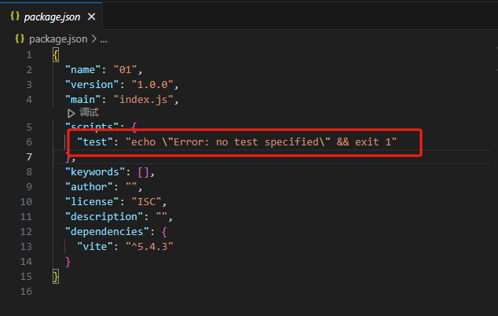

# 初识Three.js

## 简单创建一个Node.js项目

通过`npm init -y`可以在当前文件夹生成`package.json`文件来快速创建一个**[Node.js](https://nodejs.org/zh-cn)**项目。

创建好后会生成2个文件和一个目录，`node_modules`、`package-lock.json`、`package.json`。

- **node_modules** 是依赖的npm包。
- **package-lock.json** 是锁定安装时的包的版本号，以保证其他人在`npm install`时大家的依赖能保证一致。这是可选的。
- **package.json** 包含与项目相关的各种信息。该文件提供给 npm 的信息使其能够识别并处理项目的依赖关系。

## 通过vite构建项目

通过`npm install vite`安装**[vite](https://vitejs.cn/vite5-cn/)**依赖。

然后我们需要修改**package.json**中的**scripts**删除掉`test`这个脚本。



并添加 

```json
  "scripts": {
    "dev": "vite",
    "build": "vite build"
  },
```

就可以通过`npm run dev`和`npm run build` 来运行和编译项目了。

当然也可以叫` "start": "vite"` 这个无所谓看个人习惯。我比较习惯叫`dev`

## 安装Three.js

通过`npm install three` 命令来安装Three.js。