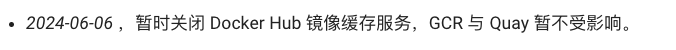
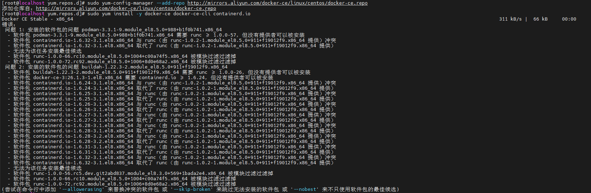

## 为什么这么简单的东西还要记录？

只能说都2024年了，还在闭关锁国🤣



本来分分钟一个一键脚本的事情，现在每次要搞七搞八的折腾半天😅

### 环境要求

1. **操作系统**
   - CentOS 8 或更高版本（64 位）
   - 推荐内核版本 ≥ 3.10（检查命令：`uname -r`）
2. **依赖工具**
   - `yum` 包管理器（默认已安装）
   - `curl` 或 `wget`（用于下载文件）

### 安装步骤

#### 前期准备工作

备份原有的镜像源配置文件

```bash
cd /etc/yum.repos.d
mkdir -p bak
cp *.repo bak/
rm -rf *.repo
```

下载新的镜像源配置文件

`  curl -o /etc/yum.repos.d/CentOS-Base.repo http://mirrors.aliyun.com/repo/Centos-8.repo`

清理并生成缓存

```bash
dnf clean all
dnf makecache
```

#### 卸载旧版本 Docker（如有）

```bash
sudo yum remove -y docker \
                  docker-client \
                  docker-client-latest \
                  docker-common \
                  docker-latest \
                  docker-latest-logrotate \
                  docker-logrotate \
                  docker-engine
```

#### 安装依赖工具

`sudo yum install -y yum-utils device-mapper-persistent-data lvm2`

#### 添加 Docker 官方仓库

```bash
# 使用官方源（国际网络）
sudo yum-config-manager --add-repo https://download.docker.com/linux/centos/docker-ce.repo

# 或使用阿里云镜像加速（国内推荐）
sudo yum-config-manager --add-repo http://mirrors.aliyun.com/docker-ce/linux/centos/docker-ce.repo

```

#### 安装 Docker引擎

```bash
# 安装最新稳定版 
sudo yum install -y --allowerasing docker-ce docker-ce-cli containerd.io
```

使用 `--allowerasing` 选项来允许卸载旧的、冲突的软件包否则会出现 `runc` 版本相关的依赖冲突问题，这个错误的原因是 CentOS 8 的模块过滤导致某些版本的 `runc` 被排除，而 Docker 和 `containerd.io` 需要与特定版本的 `runc` 兼容。



#### 启动 Docker 并设置开机自启

```bash
sudo systemctl start docker
sudo systemctl enable docker
```

### 验证安装

#### 检查 Docker 版本

```bahs
docker --version
# 输出示例：Docker version 20.10.17, build 100c701
```

### 配置镜像代理

如果不自建镜像代理只能在互联网上找好心人公开的公益服务了，下面是我找到的两个收集国内可用docker镜像的站点。

https://status.1panel.top/status/docker

https://github.com/dongyubin/DockerHub?tab=readme-ov-file

```bash
# 将内容写入 /etc/docker/daemon.json 文件，root 用户可以去掉 sudo
# 配置 Docker 镜像，使用多个镜像源来提高镜像下载速度
echo '{
  "registry-mirrors": [
    "https://docker.1ms.run",
    "https://docker.1panel.live",
    "https://docker.ketches.cn"
  ]
}' | sudo tee /etc/docker/daemon.json
# 重启 Docker 服务以使配置生效
sudo systemctl restart docker
```

### 管理 Docker 权限

#### 允许非 root 用户操作 Docker

```bash
# 将当前用户加入 docker 组
sudo usermod -aG docker $USER

# 退出终端重新登录生效
```

#### 验证非 root 权限

```bash
docker ps
# 若无权限错误，则配置成功
```

## 安装 Docker Compose

新版 Docker Desktop 已自带 Compose，不用单独安装。可以检查是否有：

```bash
docker compose version
```